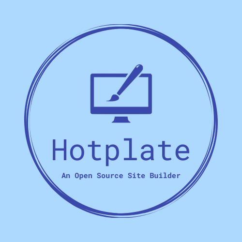

# Hotplate Sites

## An Open Source Site Builder

**This documentation is a work-in-progress.**

### Getting Started

#### Want to try Hotplate for yourself?

Head on over to [hotplate-demo.web.app](https://hotplate-demo.web.app) and use the login information below to sign in as either a webmaster or basic user so you can see what Hotplate is capable of (sorry, no admin logins; never trust a client!). If you want to see Hotplate's user management dashboard in action, you'll have to create your own site.

* Webmaster:

  * Email: test-webmaster@hotplate.com (this is a fake email address, please don't use it anywhere else or send anything to it.)
  * Password: Ic@nManag3C0ntent!
* Basic User:

  * Email: test-user@hotplate.com (this is a fake email address, please don't use it anywhere else or send anything to it.)
  * Password: S0_B@sic!

#### Want to create your own site with Hotplate?

It's great to hear that you want to use Hotplate for your next website! Many site builders out there either show ads or charge an inflated price, but Hotplate is completely free! The world wide web deserves a high-quality and user-friendly site builder that serves its users, NOT its creator! Just clone the [GitHub repository](https://github.com/awallach4/hotplate-sites), set up your [Firebase project](https://console.firebase.google.com/), and you'll be on your way!

*Note: You'll need to subscribe to the Firebase "Blaze" (paid) plan to be able to set up Hotplate's authentication system. You'll only be charged about $0.01/month, though.*

#### What about the Email Service and Calendar Service?

Hotplate comes with a pre-built email and calendar service that are both powered by Google Apps Script. If you don't want to use these, all you have to do is not enter a script URL for either on the site settings page. To use these services, create a Firebase service account with Firestore read permissions, replace the placeholders in both the EmailService.js and CalendarService.js files, and deploy them to Google Apps Script. *Neither of these services will work in this demo.*

Oh, and did I mention, there's no "catch" to Hotplate being free. I'm not asking for sponsors, donations, subscriptions, premium version fees, ad-free fees, or anything like that. Aside from what you pay Firebase for the backend and your hosting domain (if you choose to buy a different one), your site is free! Just make sure to follow the terms of the attached license file.

### About Hotplate

Hotplate began as an open-source project to build a schemaless content management system that stored data in the Firebase [Cloud Firestore](https://firebase.google.com/products/firestore?authuser=0&hl=en) database. The owner of that project then let me reverse-engineer it to understand how it worked. During this process, I noticed a file called `components.js` that defined the structure of the database. From that point, I rebuilt Hotplate to retrieve this structure from an additional collection in the Firestore database, allowing the user to define their own page structure without knowing how to program a website. After 7 months of work, I released the first version of Hotplate as a replacement website for my Boy Scout Troop. This version met their needs but contained a lot of bugs, confusing code, and a poor database structure. Three months later, I released the second version that converted my code to Typescript and the Vue Class Component API and redefined the database structure. Although a few additions were made about 5 months later, this version of Hotplate has been live for over a year, running smoothly for my troop. Now, Hotplate is finally public and rewritten in the Vue Composition API with yet another database structure that will allow for future implementation of subpages. What was once a simple CMS is now a full-scale site builder that implements multi-role authentication, dynamic theme management, and complex components such as signup sheets and a message board built to resemble the Google Classroom stream.

### Dependencies

Hotplate would not be possible without the following libraries:

* [Vue - Modern Javascript framework](https://v2.vuejs.org/)
* [Vue 2 Composition API Plugin](https://github.com/vuejs/composition-api)
* [Vue Router - Allows for page navigation](https://v3.router.vuejs.org/)
* [Pinia - State management, used for keeping you signed in and managing the navbar](https://pinia.vuejs.org/)
* [Firebase - Backend authentication, database, storage, and hosting from Google](https://firebase.google.com/)
* [FullCalendar - Creates a beautiful calendar widget component](https://fullcalendar.io/)
* [Tiptap - Creates a customizable rich text editor](https://tiptap.dev/)
* [Vuetify - Provides Material Design components to build your entire site!](https://vuetifyjs.com/)
* [DOMPurify - Sanitizes HTML and links to keep you safe from XSS attacks](https://github.com/cure53/DOMPurify)
* [Vuedraggable - Makes drag-and-drop possible in Hotplate Console](https://github.com/SortableJS/Vue.Draggable)